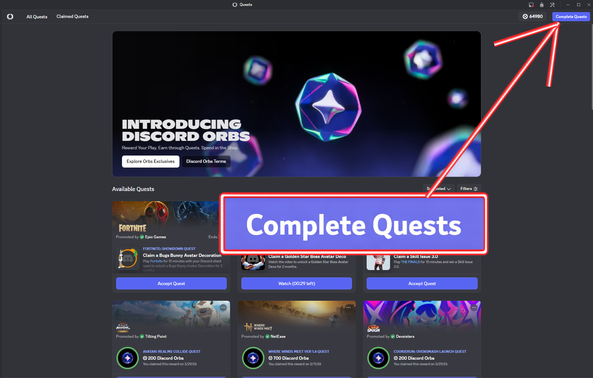

# Quest Completer

Automatically complete Discord quests!



## Features

✨ **Automatic quest completion** - The plugin helps automate quest progress after you start them

🎮 **Support for all quest types:**

* WATCH_VIDEO - Watching videos
* PLAY_ON_DESKTOP - Playing games on PC
* STREAM_ON_DESKTOP - Streaming applications
* PLAY_ACTIVITY - Playing activities in voice channels
* WATCH_VIDEO_ON_MOBILE - Watching videos on mobile

⚡ **Easy to use** - One click and you're done!

## How it works

* Go to the **Quests section** in Discord
* Manually start a quest
* Click the **"Complete Quests" button** (in the top toolbar next to the icon)

👉 The plugin will start completing the quest that the user has started.

### The plugin automatically:

* Works only with quests started by the user
* Detects their type
* Simulates the required actions to complete them


## Installation

Follow these steps to install the plugin with Vencord:

```bash
# 1. Clone Vencord repository
git clone https://github.com/Vendicated/Vencord

# 2. Open the Vencord folder using CMD / terminal
cd Vencord

# 3. Install dependencies
pnpm install

# 4A. Go to the plugins folder (default way)
cd src/plugins

# 5A. Clone the Quest Completer plugin
git clone https://github.com/1101Martin1101/autoQuestButton

# --- OR ---

# 4B. Go to src folder
cd src

# 5B. Create userplugins folder
mkdir userplugins
cd userplugins

# 6B. Clone the plugin there
git clone https://github.com/1101Martin1101/autoQuestButton

# 7. Go back to the main Vencord folder
cd ../../

# 8. Build Vencord with your new plugin
pnpm build
pnpm inject

# 9. Select your Discord client when prompted
```

Once installed, enable the plugin in the **Vencord plugin settings** inside Discord.

## Technical Details

* **Framework:** Vencord
* **Language:** TypeScript
* **License:** GPL-3.0-or-later
* **Author:** Kulih

## FAQ

**Q: Is it safe?**
A: The plugin only simulates natural activities. Discord has no issues with automating your own quests.

**Q: How long does automation take?**
A: It matches the actual quest duration (e.g., a 5-minute video = 5 minutes of waiting).

**Q: What if the plugin breaks?**
A: Simply update to a new version or disable it.

**Q: Can I choose which quests to complete?**
A: The plugin automatically detects and completes all available quests.

## Support

Having issues? Check the console (F12) for error messages.

---

## License

This project is licensed under the GNU General Public License v3.0 or later (GPL-3.0-or-later).

```
Vencord, a Discord client mod
Copyright (c) 2025 Kulih and contributors

This program is free software: you can redistribute it and/or modify
it under the terms of the GNU General Public License as published by
the Free Software Foundation, either version 3 of the License, or
(at your option) any later version.

This program is distributed in the hope that it will be useful,
but WITHOUT ANY WARRANTY; without even the implied warranty of
MERCHANTABILITY or FITNESS FOR A PARTICULAR PURPOSE.  See the
GNU General Public License for more details.

You should have received a copy of the GNU General Public License
along with this program.  If not, see <https://www.gnu.org/licenses/>.
```

### Third-party Licenses

This plugin uses Vencord, which is also licensed under GPL-3.0-or-later. For more information, visit the [Vencord repository](https://github.com/Vendicated/Vencord).
